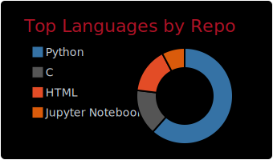

  
   
  

## Contact

## Current Stack

### Data Engineering and Warehousing

  
  
  

### Analytics and BI

  
  
  
  
  

### Data Science and Automation

## AI Focus

### Agentic AI and Applied AI

### ML/DL Algorithms and Modeling

## What I Deliver

- End-to-end analytics: ingestion, modeling, analysis, and dashboard delivery
- Fast turnaround for business-critical analysis with production-level quality
- Strong engineering mindset with pragmatic execution for real-world constraints
- Clear communication of insights for technical and business audiences

## Education

- BSc in Computer Science
- MBA/Postgraduate at USP (in progress)

## GitHub Activity

  

  

  
  

